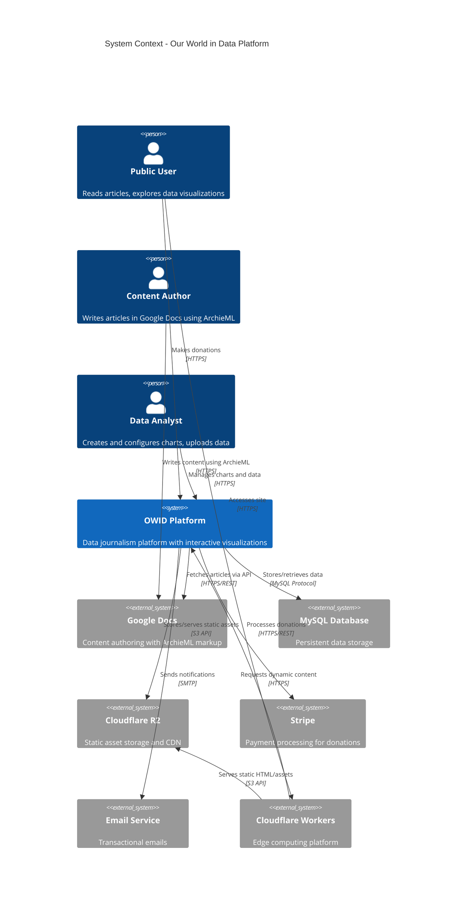

# C4 Architecture Diagrams - Our World in Data Platform

## System Context Diagram - OWID Platform

This diagram shows the OWID platform and its relationships with people and external systems.

**Legend:**

- **Person** (shown as stick figure): Human users of the system
- **System** (blue box): The OWID platform itself
- **External System** (gray box): External systems the platform integrates with
- **Relationship** (arrows): Labeled with purpose and protocol

**Key Points:**

- The OWID platform serves two primary user groups: public users (readers) and internal users (authors/analysts)
- Content is authored externally in Google Docs using ArchieML markup
- Static content is served via Cloudflare's edge network for performance
- The platform integrates with multiple external services for specialized functionality
