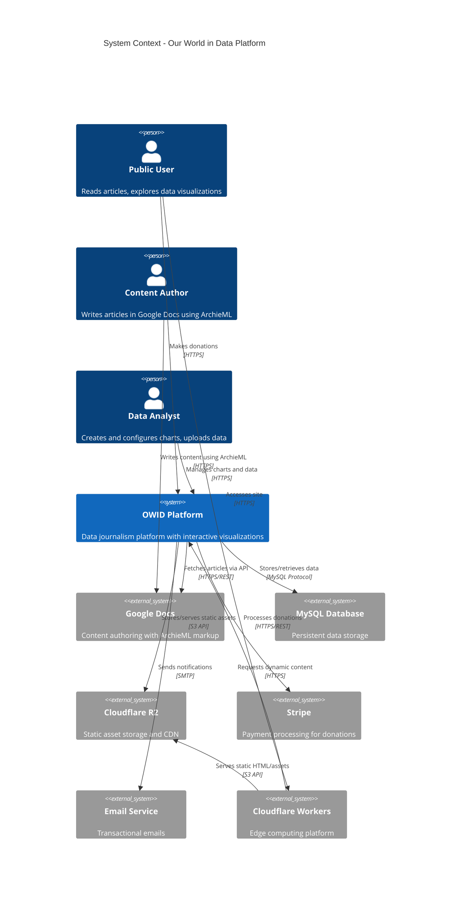

<p><a target="_blank" href="https://app.eraser.io/workspace/nTub7lm1fB4TLlsFpql0" id="edit-in-eraser-github-link"></a></p>


# C4 Architecture Diagrams - Our World in Data Platform


## System Context Diagram - OWID Platform
This diagram shows the OWID platform and its relationships with people and external systems.

[Demo cloud diagram](https://app.eraser.io/workspace/sirBEZn7DRXwEkmGU253) 

```
Git users [icon: users]
Third-party Git repository [icon: git]

AWS Cloud [icon: aws] {
  Region [icon: flag] {
    Amazon API Gateway [icon: aws-api-gateway]
    VPC [icon: aws-vpc] {
      Private subnet [icon: aws-private-subnet] {
        Lambda function [icon: aws-lambda]
        AWS CodeBuild [icon: aws-codebuild]
      }
    }
    Amazon S3 SSH key bucket [icon: aws-s3]
    AWS KMS key [icon: key]
    Amazon S3 output bucket [icon: aws-s3]
  }
}

Git users > Third-party Git repository > Amazon API Gateway > Lambda function > AWS CodeBuild > AWS KMS key
AWS CodeBuild > Third-party Git repository
AWS CodeBuild > Amazon S3 output bucket, Amazon S3 SSH key bucket
```

**Legend:**

- **Person** (shown as stick figure): Human users of the system
- **System** (blue box): The OWID platform itself
- **External System** (gray box): External systems the platform integrates with
- **Relationship** (arrows): Labeled with purpose and protocol
**Key Points:**

- The OWID platform serves two primary user groups: public users (readers) and internal users (authors/analysts)
- Content is authored externally in Google Docs using ArchieML markup
- Static content is served via Cloudflare's edge network for performance
- The platform integrates with multiple external services for specialized functionality


<!-- eraser-additional-content -->
## Diagrams
<!-- eraser-additional-files -->
<a href="/c4-context-diagram-entity-relationship-1.eraserdiagram" data-element-id="vc7gFjBMM42vEU6Kk62fM"></a>
<a href="/c4-context-diagram-cloud-architecture-2.eraserdiagram" data-element-id="XL1k9YKWD7afWLJk_YC74"></a>
<!-- end-eraser-additional-files -->
<!-- end-eraser-additional-content -->
<!--- Eraser file: https://app.eraser.io/workspace/nTub7lm1fB4TLlsFpql0 --->